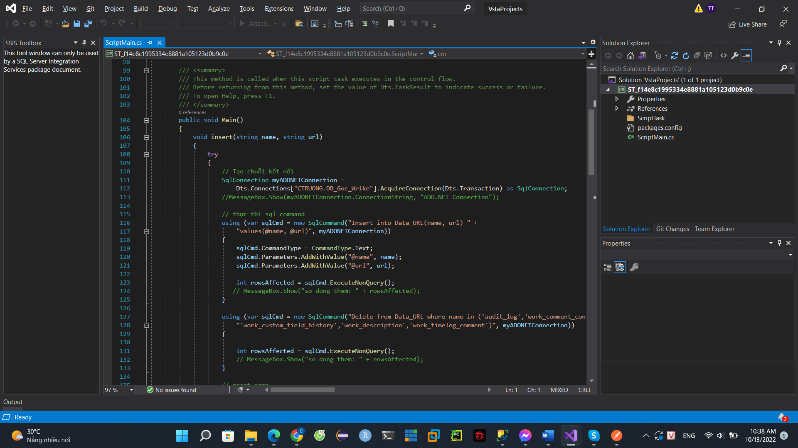

## Xây dựng Data Warehouse DWH_CongViec_Wrike và báo cáo phân tích

### Nhiệm vụ

-   Sử dụng Visual Studio load dữ liệu API từ Wrike. Sau đó xử lý và lưu
    vào Database DB_Goc_Wrike trong Sql Server

-   Thực hiện tạo Data Warehouse tên là DWH_CongViec_Wrike sử dụng Sql
    Server và Visual Studio với dữ liệu công việc đã được lấy từ Wrike
    và lưu vào database trong Sql Server từ trước.

-   Thực hiện phân tích dữ liệu công việc với DWH đã tạo được. Xây dựng
    dashboard báo cáo tổng quan về tình hình làm việc của nhân viên và
    tình trạng của các dự án của công ty trong thời gian qua. Sử dụng
    công cụ phân tích là PowerBI

-   Tập dữ liệu: Dữ liệu gồm 1 file Json lưu tên và và url của các bảng
    dữ liệu chính. Và 32 bảng lưu thông tin của công việc.

File Json lưu thông tin các bảng dữ liệu được truy cập bằng Postman.

Một bảng lưu dữ liệu, ở đây là bảng attachment_file.

### Quá trình thực hiện:

#### Load dữ liệu API từ Wrike về Database

-   Tạo Database DB_Goc_Wrike để lưu dữ liệu lấy từ Wrike.

-   Tạo bảng Data_URL dùng để lưu dữ liệu của các bảng dữ liệu gồm Name
    và Url của các bảng.

-   Thực hiện tạo Project SSIS để tạo bảng và load dữ liệu.

-   Scrip Task (Excute SQL Task): dùng để xóa dữ liệu trong tất cả các
    bảng trước khi chạy lại project.

-   Scrip Task (Load Data URL): dùng để load file Json từ Wrike chứa
    Name và Url của các bảng dữ liệu vào table Data_Url.

-   Scrip Task (Create and load data to table): Sẽ dựa vào dữ liệu từ
    bảng Data_Url sẽ tạo ra các bảng có tên là thuộc tính Name, các
    thuộc tính của bảng là dòng đầu của dữ liệu được lấy từ URL các phần
    còn lại của dữ liệu là dữ liệu được load vào bảng vừa tạo ra.

#### Kết quả sau khi load dữ liệu về DB_Goc_Wrike

#### Tạo Database và các bảng cho nhà kho

-   Tạo database có tên DWH_CongViec_Wrike. Database này sẽ chứa dữ liệu
    của nhà kho.

-   Tạo các bảng Dim lưu thông tin các đối tượng như các dự án, nhân
    viên,...

#### Xử lý và nạp dữ liệu vào nhà kho

**Tổng quan luồn dữ liệu:**

Dữ liệu ban đầu sẽ được tạo tự động ở bảng LoaiCongViec trước, sau đó
tới bảng DuAn_Component và bảng DuAn, sau đó dữ liệu bảng NhanVien sẽ
được load. Dữ liệu trong bảng Timelog_category và bảng Date được load ra
đồng thời. Sau khi tạo hết các bảng Dim thì bảng Fact CongViec sẽ được
tạo và load dữ liệu.

-   Data Flow Task ( Create DuAn_Component): Load dữ liệu vào bảng
    DuAn_Component. Dữ liệu được lấy từ 3 bảng là custom_field,
    work_custom_field và work_project. Sau đó sẽ được xử lý, join lại
    với nhau cho ra dữ liệu bảng DuAn_Component.

-   Data Flow Task (Create Fact CongViec): Load dữ liệu vào bảng Fact
    CongViec. Dữ liệu được lấy từ bảng custom_field, work_custom_field,
    work_item, work_timelog, work_porject_to_task.

**Tương tự với các data flow task còn lại**

#### Phân tích trực quan dữ liệu bằng PowerBI

-   Sử dụng phần mềm PowerBI thực hiện load các bảng trong database
    DWH_CongViec_Wrike từ Sql Server.

-   Thực hiện tạo các biểu đồ thống kê.

Thống kê số giờ làm việc của nhân viên

Thống kê mảng công việc của từng nhân viên

Thống kê theo từng mảng công việc

Hình 48. Dashboard Bes mảng công việc

Thống kê theo dự án

